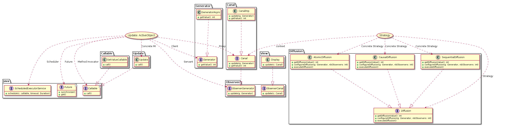

# Projet AOC
## Introduction
Le projet consiste à mettre en place le design pattern *Active Object* vu en cours, pour la diffusion de valeurs entières générées à partir d'un générateur à travers des canaux vers des afficheurs. Le but étant de proposer une conception avec différentes stratégies de diffusion: ***Diffusion atomique, séquentielle et causale.*** Pour cela, nous avons utilisé d'autres patron de conception en plus d'Active Object comme *Strategy* et *Observer*. Nous avons aussi conçu une interface graphique avec *java Swing* qui permet de visualiser les différentes valeurs des afficheurs, générateur et permet de choisir le type de diffusion.

## Choix techniques
### Patron de conception *Strategy*
Notre programme permet de générer des valeurs et de les diffuser aux afficheurs souscrits via des canaux de diffusion, cependant, il est possible de choisir le mode de diffusion qu'on souhaite sur la GUI.
Il existe trois modes de diffusion: Aomique (la mise à jour suivante est envoyée seulement si la première est reçue), Causale et Séquentielle(l'ordre d'arrivée des mises à jour n'est pas vérifié), pour donner ce choix à l'utilisateur, nous avons utilisé le PC Strategy qui répond parfaitement à ce genre de problématique de conception.
### GUI 
L'interface graphique de notre programme est réalisée avec **JavaSwing**
### Patron de conception *Active Object*
Nous avons mis en place deux fois le design pattern Active Object, parce qu'on a besoin d'appels asyncrones dans les deux sens.
Voici un exemple pour Update

